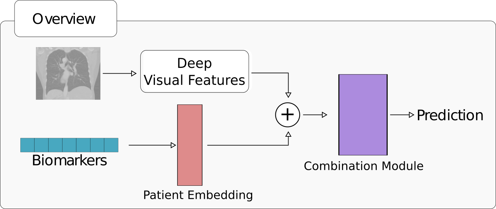

# LUCAS
This is the Pytorch implementation of [LUCAS: LUng CAncer Screening with Multimodal Biomarkers](https://link.springer.com/chapter/10.1007/978-3-030-60946-7_12) presented at the Multimodal Learning for Clinical Decision Support workshop [ML-CDS](http://mcbr-cds.org) in [MICCAI, 2020](https://www.miccai2020.org/en/).

<p align="center"></p>

# LUCAS dataset and pretrained models
You can access the LUCAS dataset, corresponding annotations, and pretrained models following this [link](http://157.253.243.19/LUCAS/)

## Installation
Requirements:

 - Python >= 3.6
 - Pytorch == 1.4
 - Numpy
 - [NiBabel](https://nipy.org/nibabel/)
 - Apex (optional, for Automatic Mixed Precision training)

## Citation
```
@inproceedings{daza2020lucas,
  title={LUCAS: LUng CAncer Screening with Multimodal Biomarkers},
  author={Daza, Laura and Castillo, Angela and Escobar, Maria and Valencia, Sergio and Pinz{\'o}n, Bibiana and Arbel{\'a}ez, Pablo},
  booktitle={Multimodal Learning for Clinical Decision Support and Clinical Image-Based Procedures},
  pages={115--124},
  year={2020},
  organization={Springer}
}
```
## Acknowledgments
This project was partially supported by the Google Latin America Research Awards (LARA) 2019.
